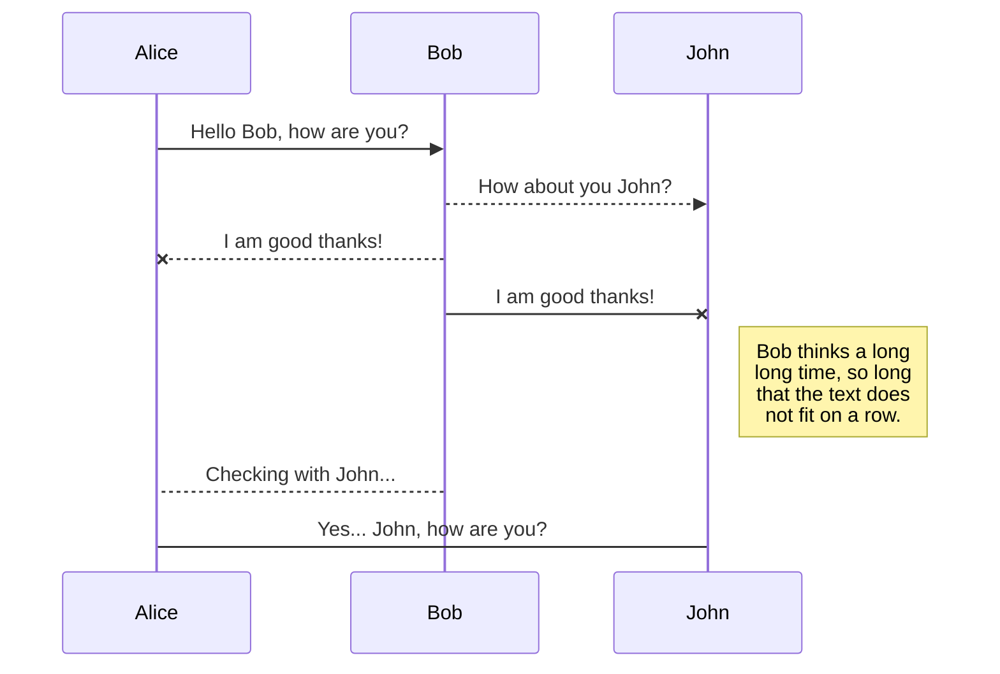
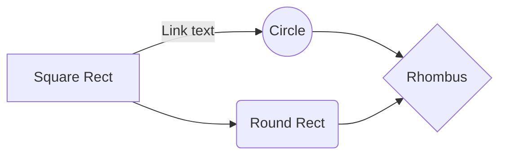

# Markdown syntax guide

## Headers

# This is a Heading h1

## This is a Heading h2

###### This is a Heading h6

## Line breaks

Inserting a single line break without starting a new paragraph

First line (followed by two trailing spaces)  
Second line (with a single break)

## Emphasis

_This text will be italic_  
_This will also be italic_

**This text will be bold**  
**This will also be bold**

_You **can** combine them_

## Lists

### Unordered

- Item 1
- Item 2
- Item 2a
- Item 2b
  - Item 3a
  - Item 3b

### Ordered

1. Item 1
2. Item 2
3. Item 3
   1. Item 3a
   2. Item 3b

## Images


## Links

You may be using [Markdown Live Preview](https://markdownlivepreview.com/).

## Blockquote

> Markdown is a lightweight markup language with plain-text-formatting syntax.
>
> > Markdown is often used to format readme files, for writing messages in online discussion forums, and to create rich text using a plain text editor.

## Tables

| Left columns | Middle columns | Right columns |
| ------------ | :------------: | ------------: |
| left         |     middle     |         right |
| left         |     middle     |         right |

## Blocks of code

```
let message = 'Hello world';
alert(message);
```

## SmartyPants

SmartyPants converts ASCII punctuation characters into "smart" typographic punctuation HTML entities. For example:

|                  | ASCII                           | HTML                          |
| ---------------- | ------------------------------- | ----------------------------- |
| Single backticks | `'Isn't this fun?'`             | 'Isn't this fun?'             |
| Quotes           | `"Isn't this fun?"`             | "Isn't this fun?"             |
| Dashes           | `-- is en-dash, --- is em-dash` | -- is en-dash, --- is em-dash |

## KaTeX

You can render LaTeX mathematical expressions using [KaTeX](https://khan.github.io/KaTeX/):

The _Gamma function_ satisfying $\Gamma(n) = (n-1)!\quad\forall n\in\mathbb N$ is via the Euler integral

$$
\Gamma(z) = \int_0^\infty t^{z-1}e^{-t}dt\,.
$$

> You can find more information about **LaTeX** mathematical expressions [here](http://meta.math.stackexchange.com/questions/5020/mathjax-basic-tutorial-and-quick-reference).

## UML diagrams

You can render UML diagrams using [Mermaid](https://mermaidjs.github.io/). For example, this will produce a sequence diagram:



And this will produce a flow chart:


